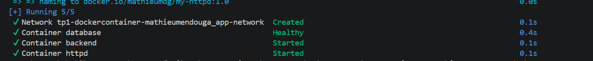
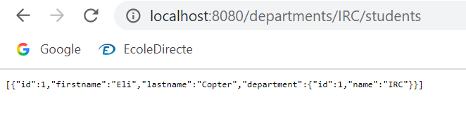
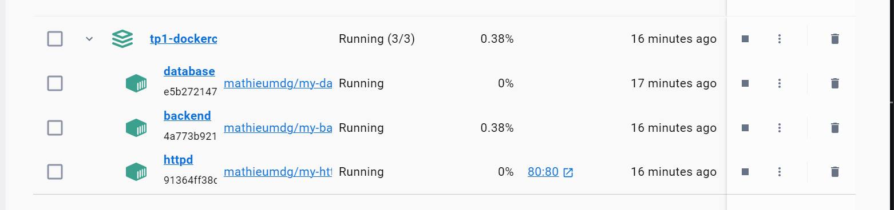

# TP1 - Docker - Mathieu MENDOUGA

3-tier application: HTTP server (Apache httpd) → Backend API (Spring Boot) → Database (PostgreSQL).

| Part | Folder |
|---|---|
| Database | [database/](./database/README.md) |
| Backend (Hello World + Spring Boot API) | [backendApi/](./backendApi/README.md) and [simpleapi/](./simpleapi/README.md) |
| HTTP server + reverse proxy | [httpd/](./httpd/README.md) |
| docker-compose and publication | this file |

## Project structure

```
.
├── docker-compose.yml
├── .env
├── database/      (Dockerfile + SQL init scripts)
├── backendApi/    (Hello World, simple and multistage)
├── simpleapi/simpleapi/   (Spring Boot API + Dockerfile)
└── httpd/         (Dockerfile, httpd.conf, index.html)
```

---

## Docker-compose

### docker-compose.yml

```yaml
services:
  database:
    build: ./database
    image: mathieumdg/my-database:1.0
    container_name: database
    restart: unless-stopped
    env_file: .env
    volumes:
      - db-data:/var/lib/postgresql/data
    networks:
      - app-network
    healthcheck:
      test: ["CMD-SHELL", "pg_isready -U $${POSTGRES_USER} -d $${POSTGRES_DB}"]
      interval: 5s
      timeout: 5s
      retries: 10

  backend:
    build: ./simpleapi/simpleapi
    image: mathieumdg/my-backend:1.0
    container_name: backend
    restart: unless-stopped
    networks:
      - app-network
    depends_on:
      database:
        condition: service_healthy

  httpd:
    build: ./httpd
    image: mathieumdg/my-httpd:1.0
    container_name: httpd
    restart: unless-stopped
    ports:
      - "80:80"
    networks:
      - app-network
    depends_on:
      - backend

networks:
  app-network:

volumes:
  db-data:
```

`.env` (not committed, see `.env.example`):

```
POSTGRES_DB=db
POSTGRES_USER=usr
POSTGRES_PASSWORD=pwd
```

### 1-8 Document your docker-compose file

- **database**: built from `./database`. Credentials come from `.env` (`env_file`) so they are not written in the image. The named volume `db-data` persists the data. The healthcheck (`pg_isready`) tells compose when Postgres is really ready to accept connections.
- **backend**: built from the Spring Boot project. It waits for the database to be *healthy* (`depends_on` with `service_healthy`) before starting. No port is published: it is only reachable from the internal network.
- **httpd**: the only service publishing a port (`80:80`). It is the single entry point and forwards requests to `backend:8080`.
- **networks**: a single `app-network` so the services reach each other by service name (`database`, `backend`).
- **volumes**: `db-data` is managed by Docker and survives `docker compose down`.
- **restart: unless-stopped**: containers restart automatically after a crash or a reboot.
- `image:` names are set so that the images built by compose are already tagged for Docker Hub.

### Result

```bash
docker compose up -d --build
docker compose ps
```



```bash
curl http://localhost/departments/IRC/students
```



### 1-6 Why is docker-compose so important?

It describes the whole architecture (services, networks, volumes, variables, start order) in one versioned file. A single command builds, links and starts every container in a reproducible way, instead of typing and remembering many `docker run` commands. Anyone can start the full stack on any machine the same way.

### 1-7 Document docker-compose most important commands

| Command | Role |
|---|---|
| `docker compose up -d --build` | Build the images and start all services in the background |
| `docker compose down` | Stop and remove containers and networks (`-v` also removes volumes) |
| `docker compose ps` | List the services and their status |
| `docker compose logs -f <service>` | Follow the logs of a service |
| `docker compose build` | Rebuild the images only |
| `docker compose restart <service>` | Restart a service |
| `docker compose exec <service> <cmd>` | Run a command in a running service |
| `docker compose push` | Push the images to the registry |

---

## Publication

```bash
docker login
docker compose push
```

Equivalent manual commands (images are already tagged by the compose file, otherwise use `docker tag`):

```bash
docker tag my-database mathieumdg/my-database:1.0
docker push mathieumdg/my-database:1.0
docker push mathieumdg/my-backend:1.0
docker push mathieumdg/my-httpd:1.0
```



Published images:
- https://hub.docker.com/r/mathieumdg/my-database
- https://hub.docker.com/r/mathieumdg/my-backend
- https://hub.docker.com/r/mathieumdg/my-httpd

### 1-10 Why do we put our images into an online repo?

To share images with the team, pull them on any machine or server without rebuilding, keep versions through tags, and use them in CI/CD pipelines and deployments.
