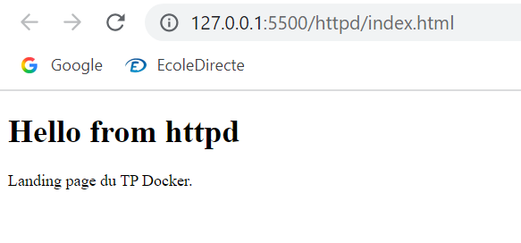
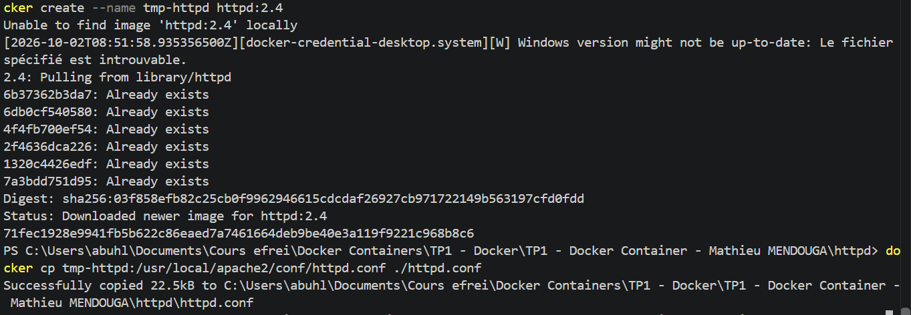

# HTTP server

Image used: `httpd:2.4` (Apache).

## Basics

`index.html`: simple landing page.

`Dockerfile`:

```dockerfile
FROM httpd:2.4
COPY index.html /usr/local/apache2/htdocs/
COPY httpd.conf /usr/local/apache2/conf/httpd.conf
```

Landing page test, before the proxy was configured:



Useful commands: `docker logs`, `docker stats`, `docker inspect`.

## Configuration

The default configuration was retrieved from a container:

```bash
docker create --name tmp-httpd httpd:2.4
docker cp tmp-httpd:/usr/local/apache2/conf/httpd.conf ./httpd.conf
docker rm tmp-httpd
```



## Reverse proxy

Modules enabled in `httpd.conf`:

```apache
LoadModule proxy_module modules/mod_proxy.so
LoadModule proxy_http_module modules/mod_proxy_http.so
```

Added at the end of the file:

```apache
<VirtualHost *:80>
    ProxyPreserveHost On
    ProxyPass / http://backend:8080/
    ProxyPassReverse / http://backend:8080/
</VirtualHost>
```

`backend` is the service name resolved by the Docker network.


### 1-5 Why do we need a reverse proxy?

It is a single entry point in front of the application. The backend and the database stay hidden on the internal network, and the proxy can also handle SSL/TLS, load balancing, caching, compression, and serve a front-end, without changing the backend.